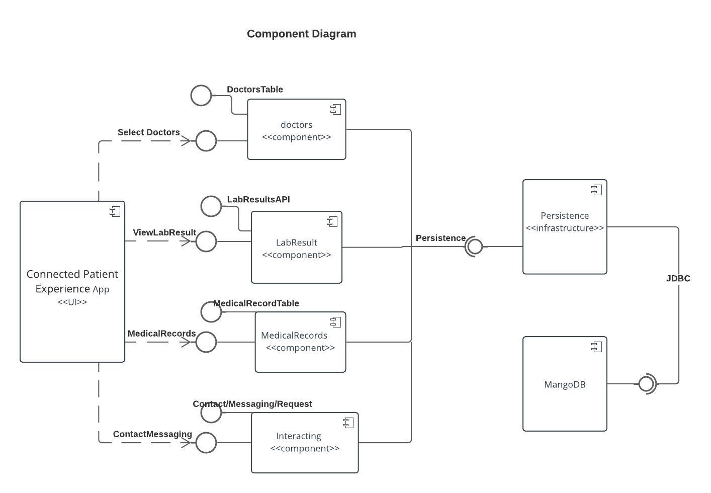
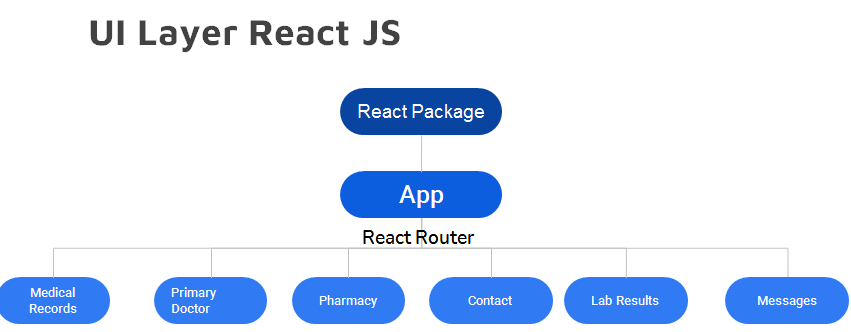
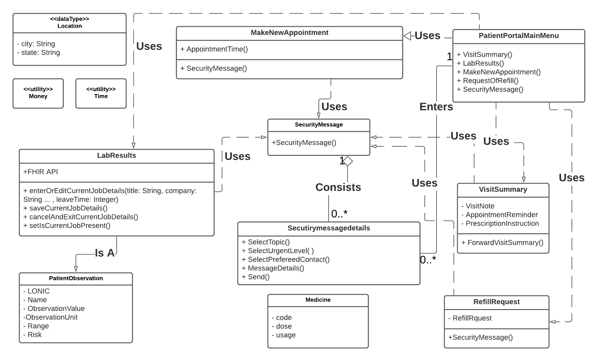
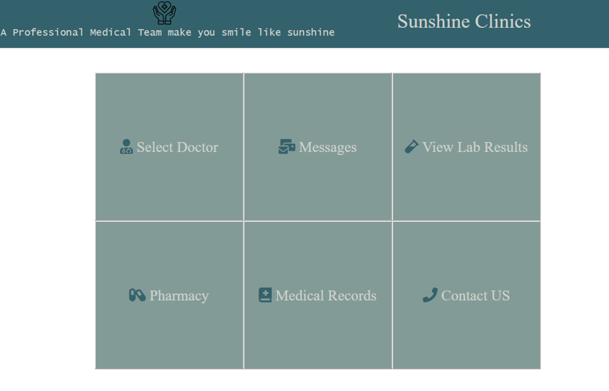

# Design Document

### Team Name

Team 10

### Team members

1. Xiaochu Lou, xlou34, xlou34@gatech.edu
2. Yian Chen, ychen855, ychen855@gatech.edu
3. Chih-Yuan Su, csu68, csu68@gatech.edu

### Project Name

Project #22: Connected Patient Experience

## 1 Design Considerations

### 1.1 Assumptions

·    Issue: Patients surround the disconnect between them and their practice, along with the inability to access their data easily.

·    Current solution: Patient portals were supposed to be the solution of the above issue.

·    Gaps: Patient surveys still indicate a great disconnect in the patient experience with current patient portals. Furthermore, portals have sometimes proven to be too confusing for patients, or have just not provided enough longstanding value. 

·    New solution: The application is going to build new patient portal with focusing on user-friendly features.

### 1.2 Constraints

The application is a user-friendly app running on a multiple systems. The user need to login to the app to enforce the security.  However, there is no interactions between devices the application will be mostly standalone. Also the application must persist between runs.

### 1.3 System Environment

The application will be deployed using HDAP: The GT Health Data Analytics Platform at current stage. The application will be able to running multiple systems, especially web-based environment. 

## 2 Architectural Design

### 2.1 Component Diagram

The diagram below shows various logical/functional components of our architecture and how they are connected. Each component represents a cluster of related functionality. Following are the components in our design.

### 2.2 Deployment Diagram

The application will run on HDAP for deployment.  The below diagram shows the deployment of our application.

## 3 Low-Level Design

### 3.1 Class Diagram

The class diagram can be seen below. All the names used in all the diagrams above are such that the logical structuring of the entire architecture becomes easy to understand. Each component of the component diagram discussed earlier contains multiple classes from the class diagram to provide the discussed functionalities. 

## 4 User Interface Design

Blow is the main interface screens that form the part of the UI design. A full demo of the user interface could be found from the video demo from the following link: https://youtu.be/oG9mXxse8Yw

